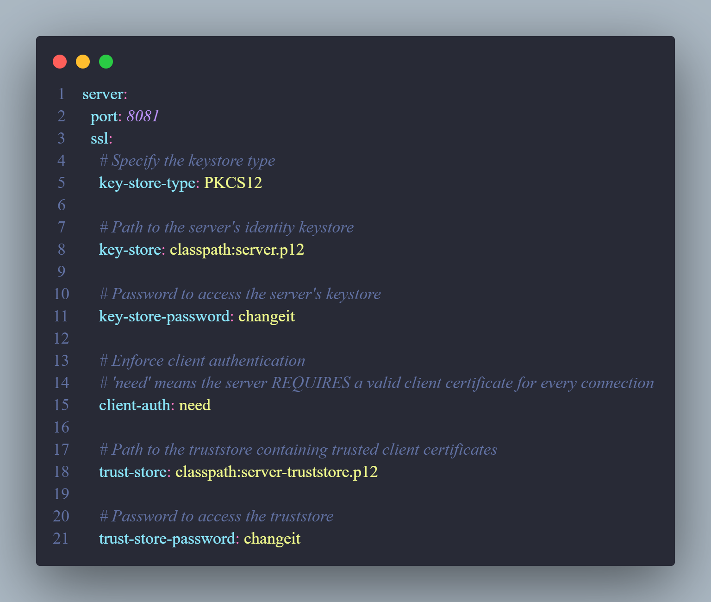
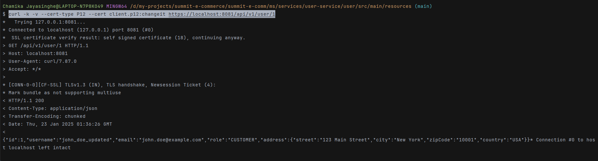

# TLS vs MTLS

**TLS (Transport Layer Security)**

- TLS is like a secure tunnel between a client and server
- It provides:
  1.  Encryption: Data transmitted is encrypted, preventing eavesdropping
  2.  Data Integrity: Ensures data hasn't been tampered with during transmission
  3.  Server Authentication: The server proves its identity to the client using a certificate
- In standard TLS, only the server has a certificate, and only the server is verified

**mTLS (Mutual TLS)**

- mTLS adds client authentication to standard TLS
- Both parties must present certificates and verify each other
- It provides:
  1.  Everything TLS provides (encryption, integrity, server authentication)
  2.  Plus Client Authentication: The client must also prove its identity with a certificate
- Perfect for microservices architecture because ->

  - **Service-to-Service Authentication**: Each service can verify the identity of other services
  - **Zero Trust Security**: Every request must be authenticated, regardless of source

  # MTLS Workflow used below

1. Client presents its certificate
2. Server validates client certificate
3. Client validates server certificate
4. Secure, encrypted communication established

# Setup

1. **Generating the server.p12 file using keytool**

```
keytool -genkeypair -alias server -keyalg RSA -keysize 4096 -validity 365 -dname "CN=Server,OU=Server,O=Examples,L=,S=CA,C=U" -keypass changeit -keystore server.p12 -storeType PKCS12 -storepass changeit
```

2 **Client Setup**

```
# Generated client's identity
keytool -genkeypair -alias client -keystore client.p12
# Exported client's public cert
keytool -export -alias client -file client.cer
```

3. **Trust Setup**

```
# Created server's truststore with client's cert
keytool -import -alias client -file client.cer -keystore server-truststore.p12
```

4. **Configuration done in application.properties file**
   

# Demo

- Command used ->

```
 curl -k -v --cert-type P12 --cert client.p12:changeit https://localhost:8081/api/v1/user/1

```


